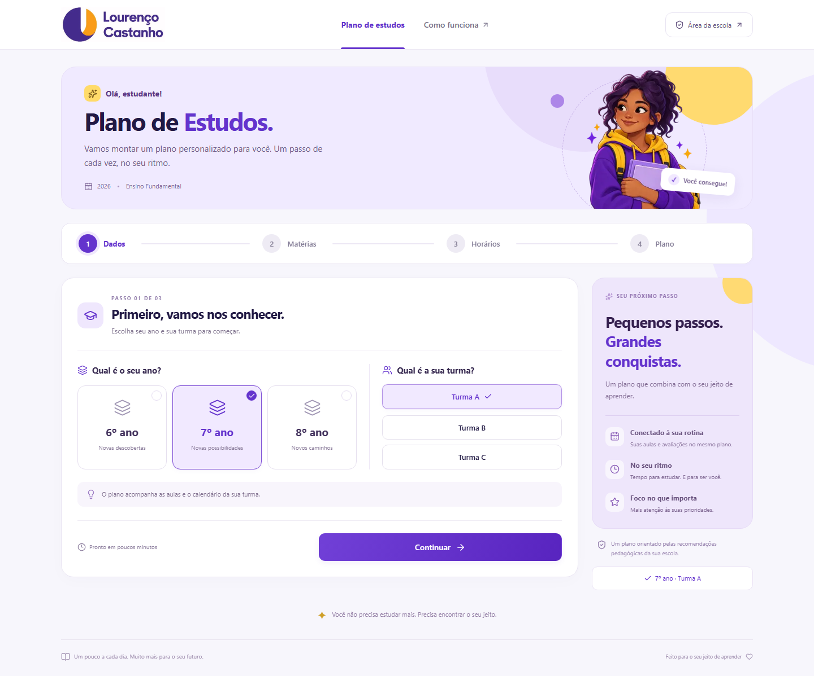

# Plano de Estudos

Aplicação em Next.js, React, TypeScript e Tailwind para criar planos de estudo com regras determinísticas. O motor não usa serviços de IA, geração de texto, embeddings ou chamadas a modelos. A interface segue as referências visuais fornecidas, com o logo oficial e uma ilustração estática criada durante o desenvolvimento com imagegen. O aplicativo não chama esse serviço. Consulte [o registro visual e o prompt da ilustração](docs/visual-design.md).



## Executar localmente

Requer Node.js 22 ou superior.

```powershell
npm install
npm run dev
```

Abra **http://localhost:3000/student**. O painel está em **http://localhost:3000/admin**. O servidor de desenvolvimento escuta somente na interface local (`127.0.0.1`).

Sem credenciais Supabase, a aplicação lê os exemplos em `data/seed/school-data.json`. Alterações administrativas são gravadas em `.local/school-data.json`; planos são gravados em `.local/plans/`. A persistência é no servidor e funciona entre recargas e navegadores. O diretório é privado, não versionado e não publicado como arquivo estático.

No desenvolvimento local, o Admin é acessível sem senha. Para protegê-lo, copie `.env.example` para `.env.local`, defina `ADMIN_PASSWORD` e reinicie o servidor. Em produção a senha é obrigatória. A sessão administrativa usa cookie HTTP-only assinado, com validade de oito horas, SameSite Strict e Secure em produção. As APIs de escrita verificam a sessão e a origem da requisição. O endpoint de login limita tentativas em memória; em múltiplas instâncias, utilize também rate limiting compartilhado no proxy.

## Fluxo do aluno

1. Informar o nome e escolher um ano e uma turma ativos.
2. Selecionar e ordenar prioridades com os botões de subir/descer. Nenhuma prioridade também é permitido.
3. Marcar disponibilidade por clique, toque ou arraste com mouse. Teclado: Tab e espaço. Horários consecutivos são agrupados; nome e período são opcionais.
4. Gerar e visualizar semanas, eventos e etapas de cada sessão.
5. Abrir “Por que isso está aqui?” e baixar um PDF real, com etapas e durações, cabeçalho, período e paginação.

Os planos salvos usam um retrato completo das configurações. Mudanças no Admin afetam somente os próximos planos. URLs de planos têm identificadores UUID não sequenciais; qualquer pessoa com o link pode abri-lo. Informe apenas o primeiro nome ou um apelido, pois qualquer pessoa com o link pode vê-lo. A aplicação não implementa contas individuais de alunos neste MVP.

## Arquitetura

```text
JSON / Supabase PostgreSQL
           ↓
SchoolRepository + validação Zod e referências
           ↓
StudyPlanEngine (TypeScript puro, sem React)
           ↓
pontuação → distribuição → validação
           ↓
StudyPlanRepository → interface e PDF
```

- `src/domain/types.ts`: contratos tipados e schemas Zod.
- `src/domain/study-plan/engine.ts`: cálculo e validação, sem dependências de interface ou banco.
- `src/repositories/school-repository.ts`: adaptadores local e Supabase.
- `src/services/import-export.ts`: importação estruturada e portabilidade.
- `src/services/pdf.ts`: PDF gerado no cliente.
- `data/seed/`: arquivos separados por entidade, além do arquivo agregado usado no primeiro acesso.
- `supabase/migrations/`: estrutura PostgreSQL e funções transacionais.

### Regras do motor

A entrada inclui turma, datas explícitas, prioridades e disponibilidade. A data atual e o UUID são adicionados pela API depois do cálculo; o motor recebe apenas dados explícitos e retorna o mesmo resultado para a mesma entrada.

O motor normaliza horários, elimina feriados configurados e calcula uma carga semanal pelo percentual disponível. Distribui cotas em rodadas entre os dias, respeitando o limite diário e a duração mínima. Dentro das cotas, avalia combinações de disciplina, material e receita. Usa prioridades ordenadas, aulas que terminaram antes da sessão, preparação de eventos por fase, repetição espaçada e preferência de material. Empates são resolvidos por prioridade, proximidade do evento, última sessão, ID da disciplina e ID da receita.

Os materiais têm mínimos semanais e dias preferidos configuráveis. O motor reserva as últimas oportunidades para tentar atender mínimos pendentes. Quando uma restrição não pode ser cumprida, retorna um aviso, sem extrapolar a disponibilidade. A heurística não é um otimizador matemático global: combinações restritivas de duração, recursos e horários podem produzir avisos ou deixar tempo sem alocação. O percentual é um teto de carga por semana, arredondado para baixo em múltiplos da sessão mínima; janelas pequenas podem exigir mais disponibilidade.

Textos das atividades vêm dos templates; durações e etapas vêm das receitas. LES, EVO, nomes de disciplinas e escola existem somente nos dados. Os códigos dos critérios de pontuação são a API fixa do motor: alterar seu valor, ativação, calendário, materiais, tipos, fases e textos não exige código; criar uma fórmula de pontuação inédita exige um novo critério no motor. Não adicione códigos desconhecidos esperando uma fórmula automática.

`validateStudyPlan()` verifica disponibilidade, duração, sobreposição, limite diário, materiais, feriados, mínimos semanais e cobertura de prioridades/eventos. Desvios pedagógicos geram avisos; o plano não inventa horários para resolvê-los. A distribuição entre dias e a carga percentual são impostas durante a alocação e cobertas por testes.

## Manter os dados no Admin

As alterações ficam em rascunho até **Salvar alterações**.

- **Anos e turmas:** criar, editar, ordenar, ativar e desativar. Os identificadores são estáveis; nomes e códigos podem mudar.
- **Disciplinas:** editar nome, sigla, cor, ícone e vínculos com turmas. Ícones disponíveis: Calculator, BookOpen, FlaskConical, Globe2, Landmark, Languages, MessageCircle e Layers; outros usam BookOpen.
- **Grade horária:** escolher turma e editar cada célula. A tabela “Aulas” permite alterar horários e criar períodos. As disciplinas precisam estar vinculadas à turma.
- **Calendário:** visualização mensal ou lista; eventos podem ter escopo global, ano, turma e disciplina. Tipos controlam peso, antecedência e bloqueio, sem depender de nomes fixos.
- **Materiais:** cadastrar plataformas, links, mínimos por semana, dias preferidos e vínculos com disciplinas.
- **Atividades:** editar textos e receitas. As etapas de receitas usam JSON estruturado com `id`, `activityId`, `durationMinutes` e `order`. Copie o identificador do editor da atividade. A soma das etapas precisa corresponder à duração da receita. Uma disciplina só pode ser agendada se houver uma receita ativa compatível.
- **Regras:** editar pesos, fases de preparação, explicações e configurações de carga. Não altere os códigos dos critérios existentes.
- **Visão geral:** configurar nome da escola, ano letivo, duração padrão do plano, mínimo, limite diário, percentual, janela e dias de disponibilidade. Datas reais pertencem aos eventos, não ao rótulo do ano letivo.
- **Simular plano:** percorre o fluxo do aluno com os dados já salvos e abre o plano com `?debug=true`. O detalhamento de pontuação é liberado apenas para uma sessão administrativa autorizada ou desenvolvimento local.

Para 2027: altere o ano letivo, adicione/desative turmas e anos necessários, importe grade e calendário, atualize materiais/receitas e salve. Não é necessário alterar o algoritmo. Para preservar o histórico, exporte a configuração anterior; planos antigos já têm seus próprios snapshots.

## Importar e exportar

Em **Importar dados**, selecione calendário, grade, materiais ou backup. Baixe um CSV modelo, preencha-o, envie CSV/XLSX/JSON, confira a prévia, clique **Aplicar importação** e depois **Salvar alterações**. Limites: 5 MB e 5.000 registros. XLSX lê a primeira aba e reconhece células de data. PDFs não são interpretados automaticamente; o PDF fornecido na pasta é uma referência para preparar um calendário estruturado validado.

Calendário:

```csv
date,event_type,title,grade,class,subject
2027-03-20,assessment,AP1,7,,MAT
2027-03-28,study_guide,Roteiro,7,7A,GEO
```

Campos adicionais: `end_date`, `description`, `importance`, `affects_study_plan`. Ano, turma e disciplina vazios significam escopo mais amplo. Códigos de evento precisam estar cadastrados. Linhas iguais por título, data, ano, turma e disciplina atualizam o evento existente. Grades atualizam pela combinação turma/dia/período. Materiais são identificados pelo nome e vinculados à disciplina; inclua receitas para novos materiais no editor de atividades.

JSON de calendários/grades/materiais deve ser uma lista de objetos com os mesmos cabeçalhos do CSV. Para restauração completa, selecione **Backup completo** e use o arquivo gerado por `exportSchoolData()`. `importSchoolData()` valida a estrutura e as referências antes de aplicar. A exportação inclui a configuração, não os planos individuais.

## Supabase

1. Crie um projeto Supabase e copie `.env.example` para `.env.local`.
2. Preencha `SUPABASE_URL`, `SUPABASE_SERVICE_ROLE_KEY` e `ADMIN_PASSWORD`. A service-role key é usada somente no servidor, nunca em uma variável `NEXT_PUBLIC_*`.
3. No SQL Editor, execute `supabase/migrations/202609230001_school.sql` e depois `supabase/seed.sql`. **O seed substitui configurações existentes; use apenas no setup ou com backup.**
4. Alternativamente, com Supabase CLI e Docker instalados:

```powershell
npx supabase start
npx supabase db reset
# Para projeto remoto:
npx supabase login
npx supabase link --project-ref SEU_PROJECT_REF
npx supabase db push
npm run seed
```

5. Reinicie `npm run dev`. O Admin indicará “Supabase conectado”. Não há fallback silencioso se as credenciais configuradas falharem.

Para uma base Supabase já existente, aplique `supabase/migrations/202609240001_add_class_6d.sql` para criar a turma 6D e seus vínculos com as disciplinas sem substituir dados. Depois, cadastre a grade horária real da turma no Admin. O seed SQL é apenas para uma base nova e substitui as configurações existentes.

O schema inclui todas as entidades escolares, passos das receitas, configurações e planos. Cada entidade armazena um registro JSONB tipado como fonte de verdade; colunas geradas expõem os campos relacionais, com chaves estrangeiras e índices. Os passos das receitas também são normalizados em `study_recipe_steps`. `import_school_data` grava tudo em uma transação e serializa gravações concorrentes. `export_school_data` lê um snapshot consistente. As tabelas têm RLS e não concedem acesso anônimo/autenticado direto; apenas o servidor autorizado utiliza a service role.

Para migrar dados locais existentes, exporte o backup no Admin, configure Supabase, execute a migração, importe o backup no Admin e salve. `src/lib/database.types.ts` contém os contratos utilizados; após evoluir o schema você também pode gerar tipos completos com `supabase gen types typescript`.

## Testes e validação

```powershell
npm test
npm run typecheck
npm run build
```

Testes cobrem determinismo, horários restritos, mínimo, prioridade, evento iminente, feriado, LES/EVO, carga parcial, distribuição, eventos de outras turmas, atualização de regras, avisos, importação e portabilidade. `scripts/smoke-browser.mjs` executa um fluxo real de aluno e Admin com Playwright contra `http://127.0.0.1:3000` e gera evidências em `.local/`. Para executar: `npx playwright install chromium` e `node scripts/smoke-browser.mjs` com o servidor ativo.

## Deploy na Vercel

1. Envie este projeto para um repositório Git e importe-o na Vercel como Next.js.
2. Configure Supabase conforme acima. O armazenamento local não é adequado ao filesystem efêmero da Vercel.
3. Defina `SUPABASE_URL`, `SUPABASE_SERVICE_ROLE_KEY` e uma `ADMIN_PASSWORD` forte nas variáveis do projeto.
4. Faça o deploy com `npm run build` como comando de build. HTTPS mantém o cookie administrativo seguro.
5. Valide o calendário oficial, os materiais, o acesso administrativo e um plano completo antes de disponibilizar aos alunos.

Documentação de referência: [Next.js](https://nextjs.org/docs/app/getting-started/installation) e [RLS no Supabase](https://supabase.com/docs/guides/database/postgres/row-level-security).
